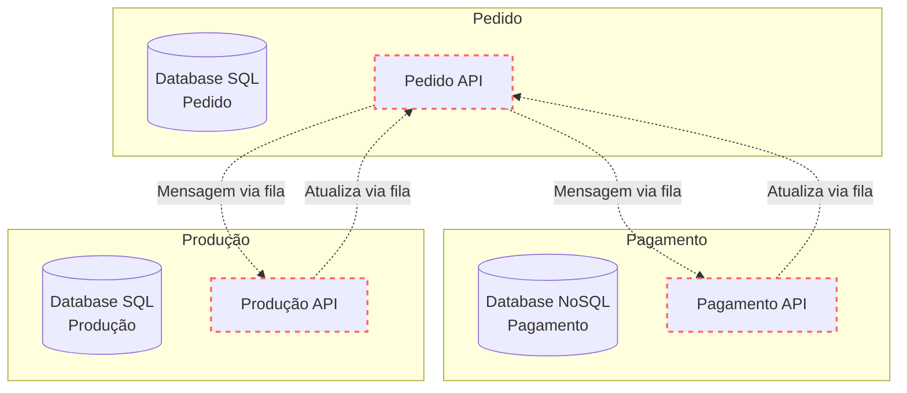

# pedido-service-fase-4
Serviço Pedido da Fase 4 do Tech Challenge

```mermaid
graph TB
    subgraph Pedido
        PedidoDB[(Database SQL<br>Pedido)]
        PedidoAPI["Pedido API"]

    end

    subgraph Pagamento
        PagamentoDB[(Database NoSQL<br>Pagamento)]
        PagamentoAPI["Pagamento API"]

    end

    subgraph Produção
        ProducaoDB[(Database SQL<br>Produção)]
        ProducaoAPI["Produção API"]

    end

    PedidoAPI -.->|Mensagem via fila| PagamentoAPI
    PedidoAPI -.->|Mensagem via fila| ProducaoAPI
    PagamentoAPI -.->|Atualiza via fila| PedidoAPI
    ProducaoAPI -.->|Atualiza via fila| PedidoAPI

    classDef async stroke:#f66,stroke-width:2px,stroke-dasharray: 5, 5;
    class PedidoAPI,PagamentoAPI,ProducaoAPI async;


```

